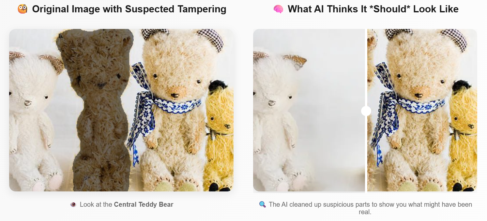
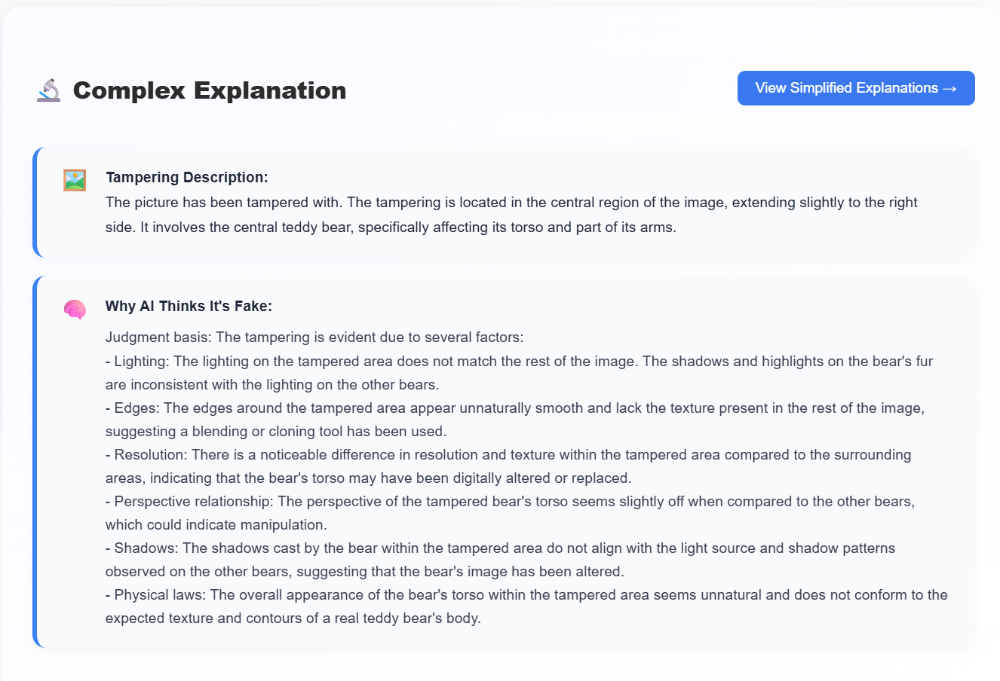
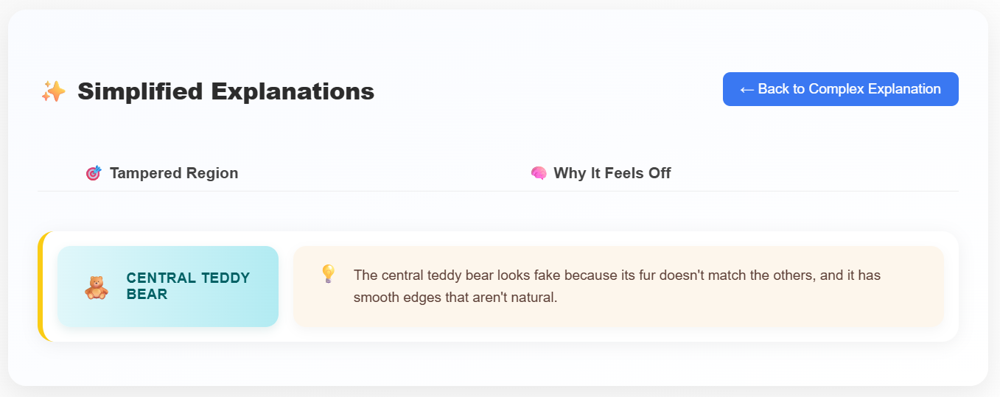

<div align="center">
  
# LayLens: Improving Deepfake Understanding through **Simplified Explanations**

[](#)
[](#)
[](#)

**LayLens** helps non‑experts understand *why* an image looks manipulated. It localizes likely edits, translates technical model reasoning into **plain language**, and visualizes a **plausible original** next to the upload.

</div>

<p align="center">
  <!-- You will supply this GIF -->
  
</p>
<p align="center"><sub>Reconstruction is a <b>plausible visualization</b>, not ground truth.</sub></p>

> **Note — Artifacts only.** This repository hosts the paper, figures, screenshots, and videos. The analysis tool and code are **not publicly released**.

---

## 🔎 TL;DR

LayLens is a three‑stage, **explainable** deepfake analysis pipeline:

1. **Explainable detection & localization** → proposes **tamper masks** and a **technical rationale** (e.g., lighting, shadow, texture cues).  
2. **Language simplification** → rewrites that rationale into concise, **layperson** statements (with emoji + edit hints).  
3. **Plausible reconstruction** → applies **guided edits** to visualize how the *unaltered* image might have looked.

A user study (n=15) found that simplified explanations **reduced cognitive load** and improved **clarity** and **confidence** when identifying deepfakes.

---

## 🧭 Project Overview

**Why.** Many detectors either offer **no explanation** or highly technical ones. LayLens bridges that gap so journalists, educators, content moderators, and everyday users can quickly see *what changed* and *why it matters*.

**What you see in the UI.**
- **Comparison view** - Left: uploaded image with a softly **pulsating mask** over suspected manipulations. Right: a **plausible reconstruction** with a **slider** to compare to the original.  
- **Explanation cards** - A **Complex** (technical) view and a **Simplified** view. Each region includes a short **“repair” instruction** describing what would undo the manipulation.  
- **Whole‑page summary** - Comparison + simplified explanations together, suitable for sharing.

---

## 🏗️ Network Architecture

<p align="center">
  
</p>

**Stage A — Explainable Detection & Localization**  
A state‑of‑the‑art, **explainable** image forgery component proposes region masks and a technical rationale describing *why* those regions look suspicious (e.g., shadow direction, texture continuity, perspective hints).

**Stage B — Language Simplification**  
A vision‑language component rewrites technical rationale into concise, **non‑jargon** explanations. Output (per region) is a compact JSON:
```json
{
  "region_name": "Left cheek",
  "explanation": "Skin texture here looks unnaturally smooth compared to nearby areas.",
  "emoji": "✨",
  "edit_instruction": "Restore realistic pores/skin grain"
}
```

**Stage C — Plausible Reconstruction**  
A guided image editing component applies **minimal, targeted edits** (guided by the per‑region instructions) to render a plausible “original” for side‑by‑side comparison. This is for **interpretation**, not forensic proof.

<details>
  <summary><b>Component mapping (conceptual)</b></summary>

  - **Explainable IFDL** — masks + regional textual rationale  
  - **VLM Simplifier** — concise, layperson JSON summaries  
  - **Guided Editing** — visualize a plausible original

  <sub>Exact model choices and parameters used in our internal tool are not public; the above is for reader orientation.</sub>
</details>

---

## 🖼️ Media Gallery

### Screenshots
### Comparison (mask + slider)
<p align="center">
  
</p>

### Complex Explanation
<p align="center">
  
</p>

### Simplified Explanation
<p align="center">
  
</p>

### Videos
<video src="https://github.com/user-attachments/assets/3e12dbd2-b555-49a8-98b1-5d4e7a0e26ae" controls playsinline muted width="720"></video>


---

## 🔬 Method Details (Conceptual)

**A. Explainable Detection/Localization**  
- Input: image `I` → outputs region masks `M₁…M_k` + longform technical rationale `E_tech` per region.  
- Cues considered: **lighting**, **shadow** direction, **texture**/noise patterns, perspective consistency, etc.  
- Output schema: `[{region_id, mask_path, rationale_long}]`

**B. Explanation Simplification**  
- Convert `rationale_long` → concise tuple `(region_name, explanation, emoji, edit_instruction)`.  
- Style: ≤1–2 sentences, avoid jargon, reference **concrete** cues (“skin grain”, “shadow angle”, “logo edge”).

**C. Plausible Reconstruction**  
- Given `(I, M₁…M_k, edit_instruction₁…k)`, apply minimal edits to approximate an **unmanipulated** look, yielding `I*`.  
- Shown side‑by‑side with a slider for visual reasoning; **not** evidence.

<details>
  <summary><b>Limitations & Responsible Use</b></summary>
  <ul>
    <li>Reconstruction is a <i>visual aid</i>, not ground truth. Always preserve the original image in reports.</li>
    <li>Localized masks may miss small manipulations or over‑highlight textured regions; human review remains essential.</li>
    <li>Avoid sensitive/private images without consent. Do not use outputs to harass, defame, or target individuals.</li>
  </ul>
</details>

---

## 📊 User Study (summary)

Within‑subjects study (**n = 15**) with 10 manipulated images per participant:
- Users preferred **simplified** explanations over complex in **65.3%** of cases.  
- **Cognitive load** was reported lower with simplified explanations in **81.3%** of comparisons.  
- The **side‑by‑side reconstruction** was considered helpful in **69.3%** of instances.  
- **Confidence** for future detection improved for **80%** of participants; **93.3%** expressed interest in using such a tool. 

(See the paper for protocol, plots, and statistics.)

---

## 📝 Citation

If you reference LayLens, please cite:

```bibtex
@inproceedings{Narang2025LayLens,
  title     = {LayLens: Improving Deepfake Understanding through Simplified Explanations},
  author    = {Narang, Abhijeet and Gupta, Parul and Su, Liuyijia and Dhall, Abhinav},
  booktitle = {Proceedings of the 27th ACM International Conference on Multimodal Interaction (ICMI '25)},
  address   = {Canberra, ACT, Australia},
  publisher = {ACM},
  year      = {2025},
  doi       = {10.1145/3716553.3757093}
}
```
