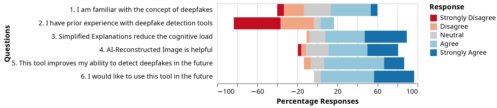

<div align="center">
  
# LayLens: Improving Deepfake Understanding through **Simplified Explanations**

[](https://icmi.acm.org/2025/proceedings/)
[](https://dl.acm.org/doi/10.1145/3716553.3757093)
[](https://arxiv.org/abs/2507.10066)

**LayLens** aims to make deepfake understanding easier for users of all educational background. It localizes likely manipuations, translates technical model reasoning into **plain language**, and visualizes a **plausible original**.

</div>

<p align="center">
  
</p>
<!-- <p align="center"><sub>Reconstruction is a <b>plausible visualization</b>, not ground truth.</sub></p> -->

> **Note: Artifacts only.** This repository hosts the paper, figures, screenshots, and videos. The analysis tool and code are **not publicly released**.

---

## 🔎 TL;DR

LayLens is a three‑stage, **explainable** deepfake analysis pipeline:

1. **Explainable detection & localization** → proposes **tamper masks** and a **technical rationale** (e.g., lighting, shadow, texture cues).  
2. **Language simplification** → rewrites that rationale into concise, **layperson** statements (with emoji + edit hints).  
3. **Plausible reconstruction** → applies **guided edits** to visualize how the *unaltered* image might have looked.

A user study (n=15) found that simplified explanations **reduced cognitive load** and improved **clarity** and **confidence** when identifying deepfakes.

---

## 🧭 Project Overview

**Why.** Many detectors either offer **no explanation** or highly technical ones. LayLens bridges that gap so users of all educational background can quickly see *what changed* and *why it matters*.

### What you see in the UI

#### Comparison view
- **Left:** Uploaded image with a softly **pulsating mask** over suspected manipulations  
- **Right:** Plausible reconstruction of how the unaltered image might have looked  
- **Slider:** Drag to compare reconstruction vs. original
<p align="center">
  
</p>

#### Complex explanation card (technical)
- **Verdict & area:** Whether the picture has been tampered with, and a brief **description of the tampered area** (e.g., location/region in the frame)
- **Judgment basis:** Organized by concrete cues, for example Lighting, Edges, Resolution, Perspective relationship, Shadows, Physical laws/patterns.
<p align="center">
  
</p>

#### Simplified explanation card (plain language)
- **Short and simplified explanation per tampered entity** explaining the *why* in everyday terms without using technical jargon. 
- **Emoji cue** for each entity (e.g., ✨, 🧩, 🕶️) to make scanning faster.
<p align="center">
  
</p>

---

## 🏗️ Network Architecture

<p align="center">
  
</p>

**Stage A — Explainable Detection & Localization**  
A state‑of‑the‑art, **explainable** image forgery component proposes region masks and a technical rationale describing *why* those regions look suspicious (e.g., shadow direction, texture continuity, perspective hints).

**Stage B — Language Simplification**  
A vision‑language component rewrites technical rationale into concise, **non‑jargon** explanations for each tampered entity and produces edit instructions for next step.

**Stage C — Plausible Reconstruction**  
A guided image editing component applies **minimal, targeted edits** (guided by the per‑region instructions) to render a plausible “original” for side‑by‑side comparison. This is for **interpretation**, not forensic proof.

---

### Videos
<video src="https://github.com/user-attachments/assets/3e12dbd2-b555-49a8-98b1-5d4e7a0e26ae" controls playsinline muted width="720"></video>


---

## 📊 User Study (summary)

Within‑subjects study (**n = 15**) with 10 manipulated images per participant:
- Users preferred **simplified** explanations over complex in **65.3%** of cases.  
- **Cognitive load** was reported lower with simplified explanations in **81.3%** of comparisons.  
- The **side‑by‑side reconstruction** was considered helpful in **69.3%** of instances.
- **Confidence** for future detection improved for **80%** of participants; **93.3%** expressed interest in using such a tool. 

<p align="center">
  
</p>

---

## 📝 Citation

If you reference LayLens, please cite:

```bibtex
@inproceedings{10.1145/3716553.3757093,
author = {Narang, Abhijeet and Gupta, Parul and Su, Liuyijia and Dhall, Abhinav},
title = {LayLens: Improving Deepfake Understanding through Simplified Explanations},
year = {2025},
doi = {10.1145/3716553.3757093},
booktitle = {Proceedings of the 27th International Conference on Multimodal Interaction},
series = {ICMI '25}
}

```
